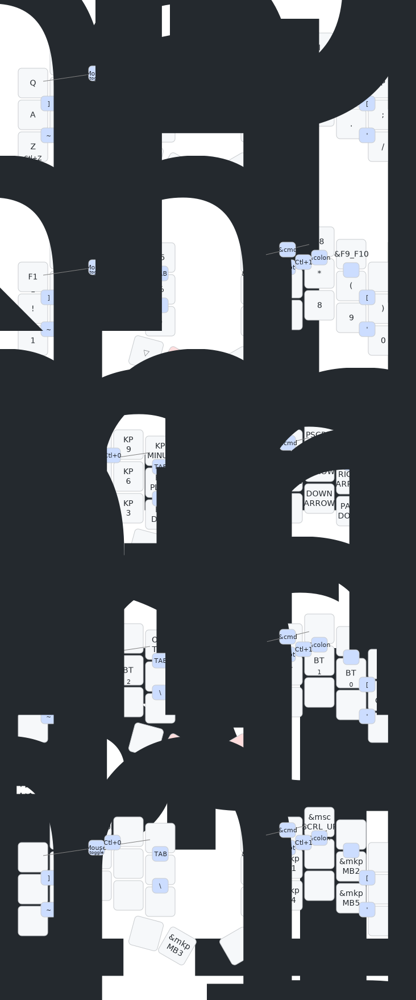

# zmk-config

  
<a href="https://github.com/AlaaSaadAbdo/Rommana">Rommana</a> (30 keys), <i><b>click here to see the keymap!</i></b>

  

  _(keymap image generated by [caksoylar/keymap-drawer](https://github.com/caksoylar/keymap-drawer))_

  
<a href="https://github.com/davidphilipbarr/Sweep">Sweep</a> (34 keys), <i><b>click here to see the keymap!</i></b>

  

  _(keymap image generated by [caksoylar/keymap-drawer](https://github.com/caksoylar/keymap-drawer))_

---

### Inspirations

- [Apsu/aptmak](https://github.com/Apsu/aptmak)
- [caksoylar/zmk-config](https://github.com/caksoylar/zmk-config)
- [joelspadin/zmk-locale-generator](https://github.com/joelspadin/zmk-locale-generator)
- [minusfive/zmk-config](https://github.com/minusfive/zmk-config)
- [stevep99/seniply](https://stevep99.github.io/seniply/)
- [urob/zmk-config](https://github.com/urob/zmk-config)

this is my code to make nrf52840 with 1.3 inch screen work as a dongle with ferris sweep

what you need nrf52840 pro micro 1.3 inch oled screen with i2c connect

Step 1 connect the screen to the controller, using pro micro pinout to identify sda and scl pin out ( SDA=P0.17, SCL=P0.20) Step 2 Fork my repo Step 3 Enable Actions, then build the firmware Step 4 download the firmware zip file, unzip. Step 5 press reset on NRF52840 twice to make it go to boot mode. A new folder will appear Step 6 copy uf2 file into the folder ( center dongle, peripheral L-R)

If you don't have the dongle yet, you can copy left center to make sweep run without dongle.

- [akaihiep123/zmk-dongle-screen-sweep](https://github.com/akaihiep123/zmk-dongle-screen-sweep)
